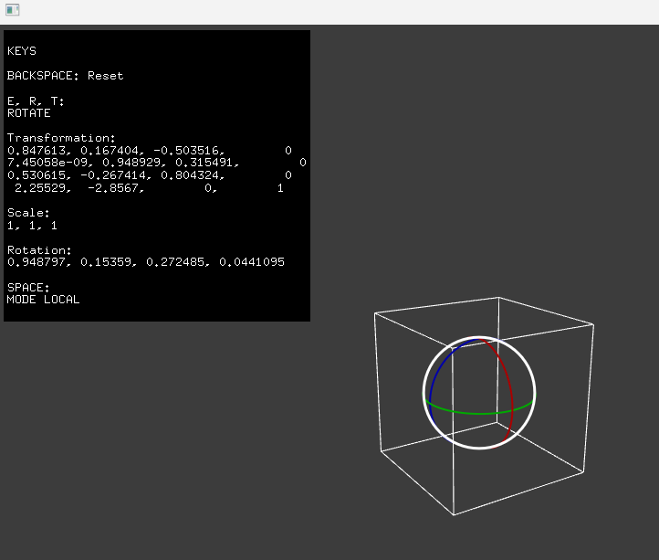

A modified version of the original addon from @nariakiiwatani:  
https://github.com/nariakiiwatani/ofxImGuizmo
- No submodules. Lib (ImGuizmo.h/.cpp) copied to `ofxImGuizmo/libs`.
- Added Helpers for simpler API with OF.
- New example `example_2`.

